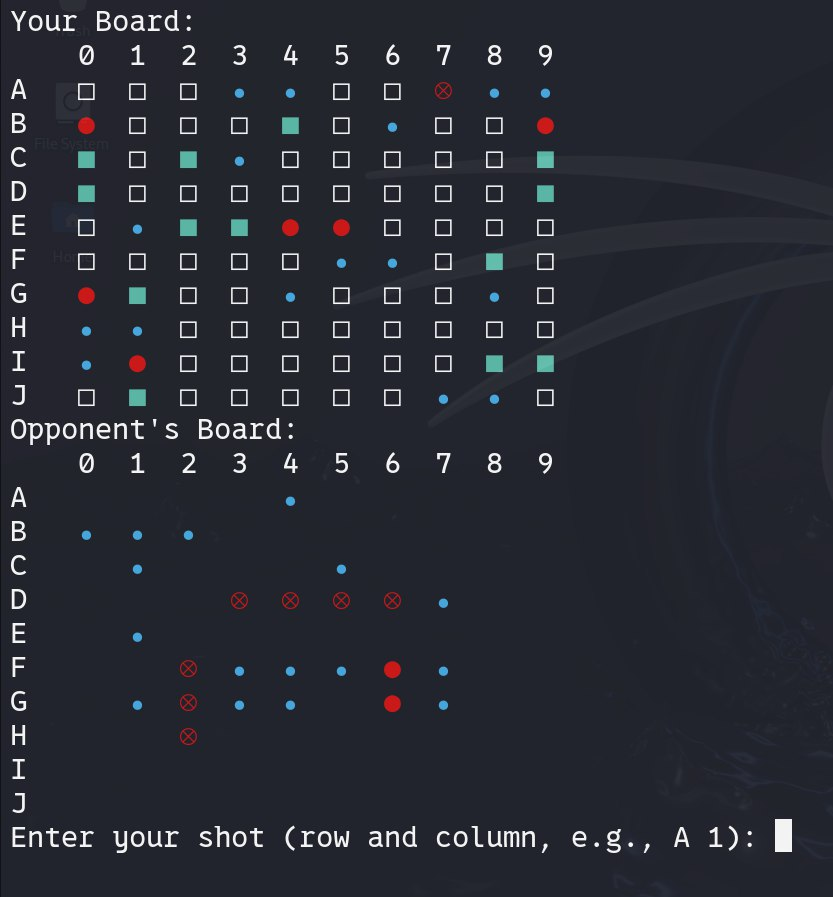

# Battleship Game 

## Description

This project is a console-based implementation of the classic Battleship game. It includes an interactive interface where the player can play against a computer. The game board is visualized using Unicode characters, and it supports colored indicators for different game states (hits, misses, sunk ships).


### Features:
- Interactive Gameplay: Play against a computer.
- Color-Coded Board:
  - Green squares represent your ships.
  - Cyan dots represent misses.
  - Red crosses indicate hits on the opponent's ships.
  - Ships are automatically marked as "sunk" when all cells are hit.
- Random Ship Placement: The ships are randomly placed on the board, ensuring that they do not touch each other (at least one empty square around).
- Multiple ship sizes: The game features:
  - 1 ship of size 4,
  - 2 ships of size 3,
  - 3 ships of size 2,
  - 4 ships of size 1.
- Game Over Detection: The game detects when all ships of either the player or the opponent are sunk.

## Installation

1. Make sure you have Rust installed.
2. Clone the repository:
   ```bash
   git clone https://github.com/Lejebooka/battleship_game_rust.git
   cd battleship_game_rust
   cargo run
   

## License

This project is licensed under the MIT License - see the [LICENSE](LICENSE) file for details.
